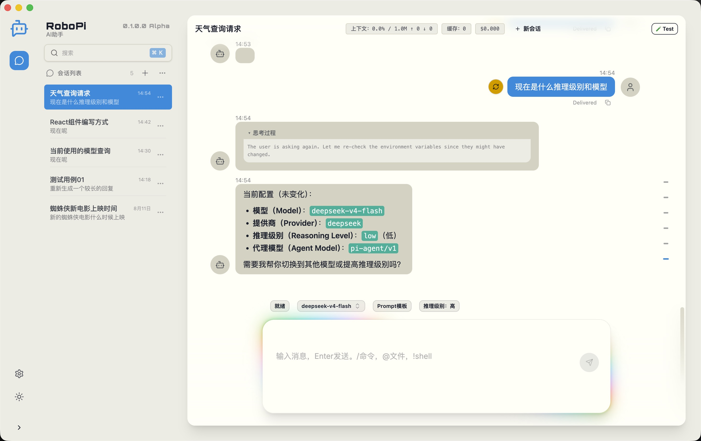
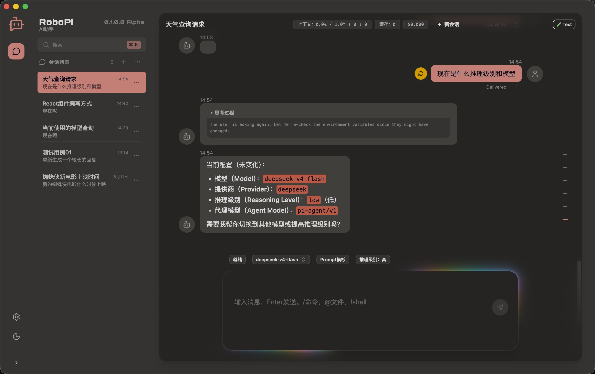
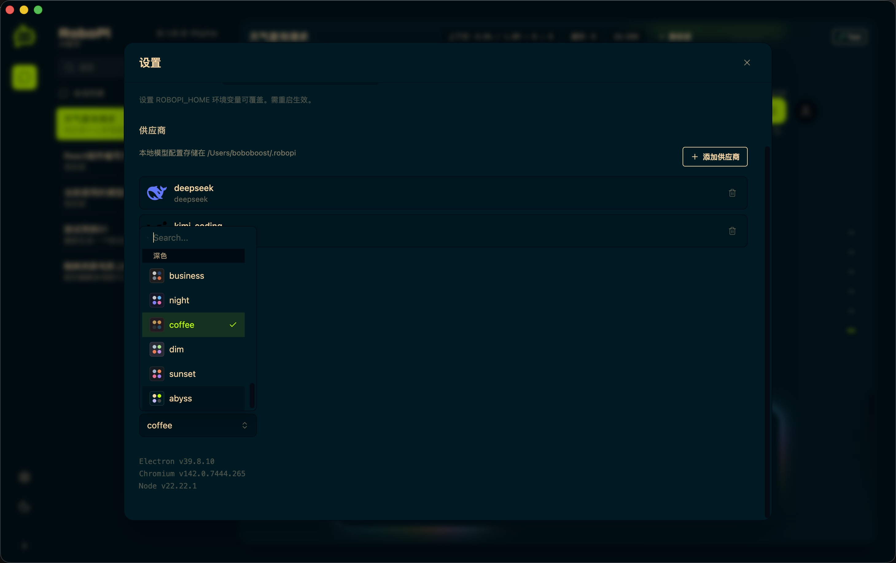
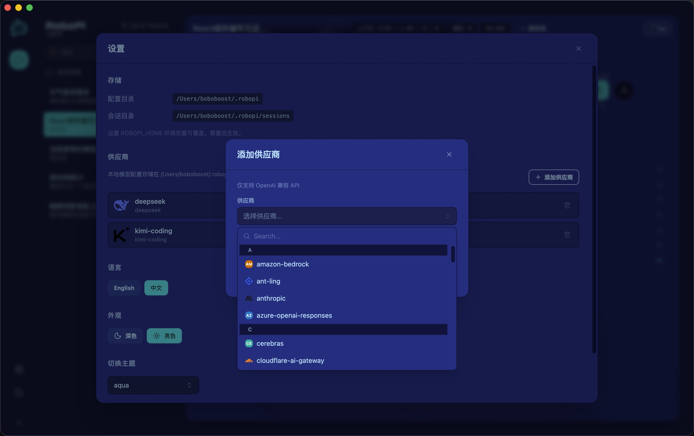

# RoboPi

> **中文** · [English](./README.md)


基于 Pi Agent 构建的桌面应用，将对话式 AI、任务自动化和知识库构建集成在同一界面中。

<table>
  <tr>
    <td></td>
    <td></td>
  </tr>
  <tr>
    <td></td>
    <td></td>
  </tr>
</table>

## 文档

- [DESIGN.md](docs/DESIGN.md) — 架构与设计决策
- [CODE_STYLE.md](docs/CODE_STYLE.md) — 代码规范与风格指南

## 推荐 IDE 配置

- [VSCode](https://code.visualstudio.com/) + [Biome](https://biomejs.dev/)

  安装 [Biome VSCode 扩展](https://marketplace.visualstudio.com/items?itemName=biomejs.biome) 并启用**保存时自动格式化**，即可使用 Biome 自动格式化代码。

## 项目设置

### 安装依赖

```bash
$ npm install
```

### 开发模式

```bash
$ npm run dev
```

### 构建

```bash
# Windows
$ npm run build:win

# macOS
$ npm run build:mac

# Linux
$ npm run build:linux
```

### 代码检查与格式化

```bash
$ npm run check    # 检查并自动修复
$ npm run lint     # 仅检查
$ npm run format   # 仅格式化
```
