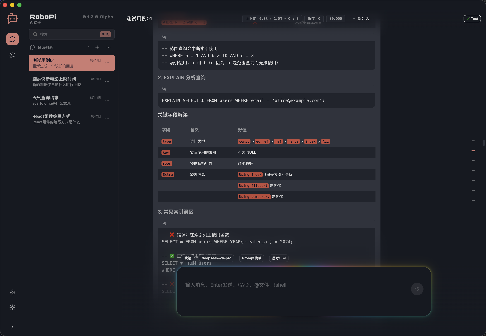

# RoboPi

> **English** · [中文](./README.cn.md)

A desktop application built on Pi Agent that integrates conversational AI, task automation, and knowledge base construction into a unified interface.



## Documentation

- [DESIGN.md](docs/DESIGN.md) — Architecture & design decisions
- [CODE_STYLE.md](docs/CODE_STYLE.md) — Code conventions & style guide

## Recommended IDE Setup

- [VSCode](https://code.visualstudio.com/) + [Biome](https://biomejs.dev/)

  Install the [Biome VSCode extension](https://marketplace.visualstudio.com/items?itemName=biomejs.biome) and enable **format on save** to automatically format your code with Biome.

## Project Setup

### Install

```bash
$ npm install
```

### Development

```bash
$ npm run dev
```

### Build

```bash
# Windows
$ npm run build:win

# macOS
$ npm run build:mac

# Linux
$ npm run build:linux
```

### Lint & Format

```bash
$ npm run check    # Check & auto-fix
$ npm run lint     # Lint only
$ npm run format   # Format only
```
